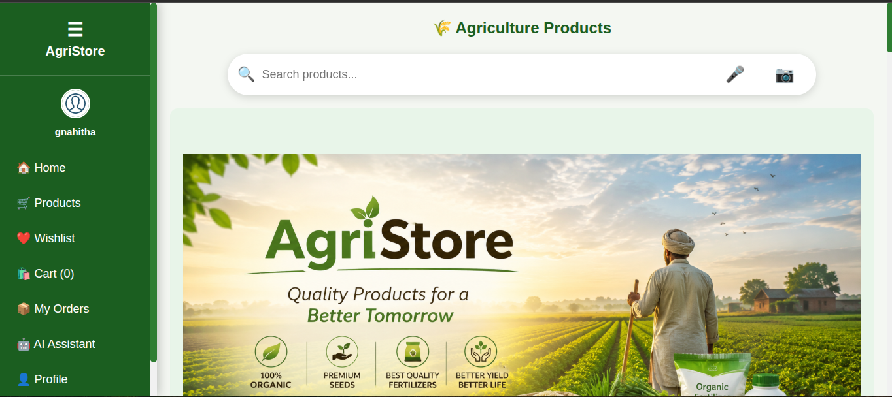
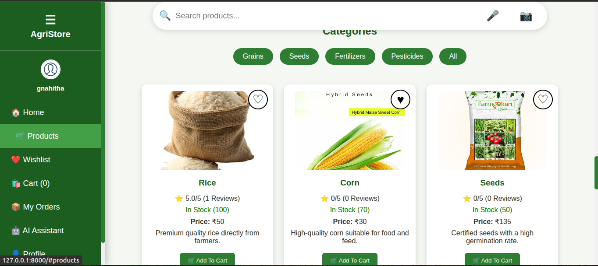
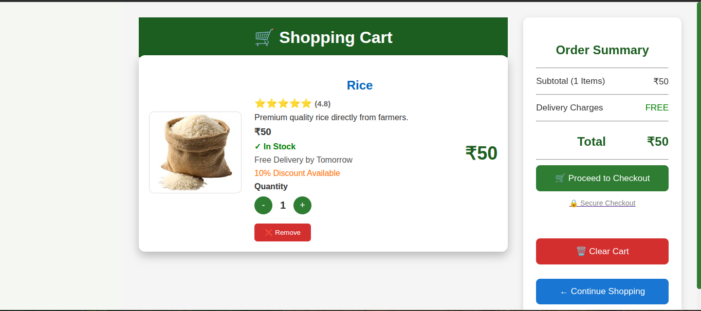
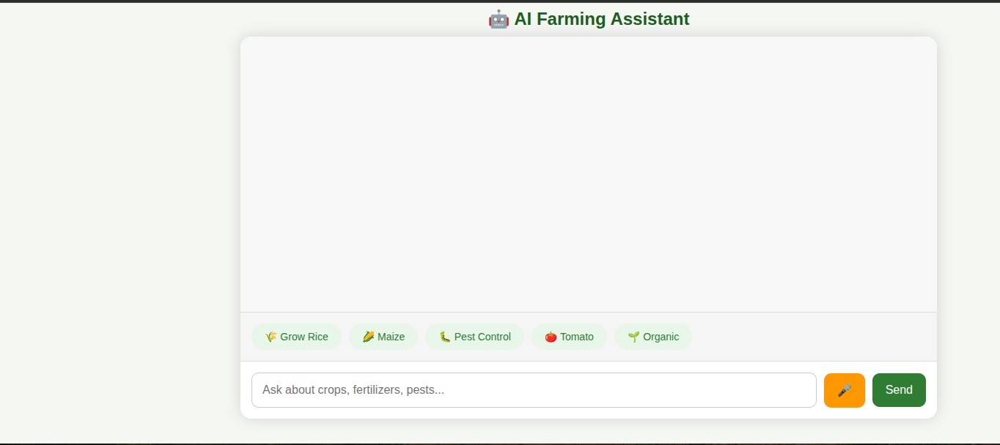

# 🌱 Agri Store

A full-stack agricultural e-commerce web application built with **HTML, CSS, JavaScript, Django, and SQLite**.

## 📌 About the Project

Agri Store is a web application designed to provide a simple online platform for browsing and purchasing agricultural products.

The project includes a user-friendly frontend and a Django backend for handling application data and functionality.

## ✨ Features

* 🛍️ Browse agricultural products
* 🔎 View product information
* 🛒 Add products to cart
* 📦 Manage shopping cart
* 👤 User-friendly interface
* ⚙️ Django backend
* 🗄️ SQLite database
* 📱 Responsive web interface
* 📦 Order tracking
* 🤖 AI Farming Assistant
* ❤️ Wishlist

## 🛠️ Technologies Used

### Frontend

* HTML5
* CSS3
* JavaScript

### Backend

* Django
* Python

### Database

* SQLite

## 📂 Project Structure

```text
AgriStore/
├── manage.py
├── requirements.txt
├── db.sqlite3
├── static/
├── templates/
└── ...
```

## 🚀 Installation and Setup

### 1. Clone the repository

```bash
git clone https://github.com/gnahitha/AgriStore.git
```

### 2. Open the project directory

```bash
cd AgriStore
```

### 3. Create a virtual environment

```bash
python -m venv venv
```

### 4. Activate the virtual environment

**Windows:**

```bash
venv\Scripts\activate
```

**Linux/macOS:**

```bash
source venv/bin/activate
```

### 5. Install dependencies

```bash
pip install -r requirements.txt
```

### 6. Apply database migrations

```bash
python manage.py migrate
```

### 7. Start the development server

```bash
python manage.py runserver
```

Open the application in your browser:

```text
http://127.0.0.1:8000/
```
## 📸 Screenshots

### 🏠 Home Page


### 🛍️ Products


### 🛒 Shopping Cart


### ❤️ Wishlist


### 🤖 AI Farming Assistant


## 🎯 Future Improvements

* Online payment integration
* Product search and filtering
* User authentication improvements
* Deployment to a production server
*  Production deployment and performance optimization

## 👩‍💻 Author

**Gnahitha Reddy**

GitHub: https://github.com/gnahitha

---

⭐ If you find this project useful, consider giving it a star!
